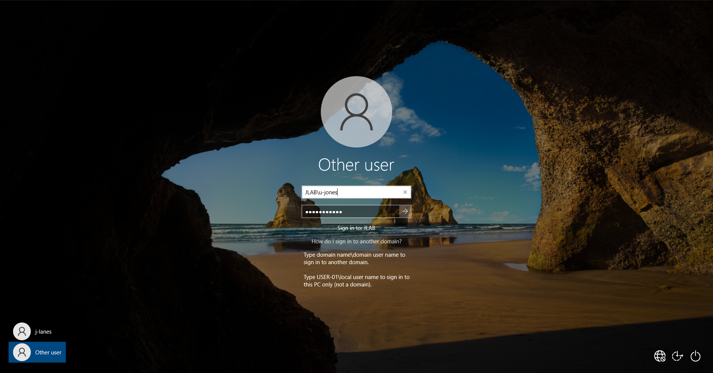

# Lab 01 – Active Directory | Building a Corporate Domain Foundation

## Objective
The goal of this lab was to build a secure, functional corporate network environment from scratch. By deploying a Windows Server 2022 Domain Controller and integrating a Windows 10 workstation, I established a centralized identity management system. This project demonstrates my ability to handle core infrastructure tasks: networking, server roles, and directory services.

## Lab Setup / Environment
- **DC-01: Domain Controller (Windows Server 2022)**
  - 2 vCPUs / 4GB RAM
  - NIC 1: `NAT`
  - NIC 2 2: `Internal Network (lab-net)`
- **USER-01: Workstation (Windows 10 Pro)**
  - 2 vCPUs / 4GB RAM
  - NIC: `Internal Network (lab-net)`
- **Domain:** `jlab.local`

---

## Phase 1: VM Setup & VirtualBox Configuration
I initialized the virtual machines using VirtualBox, ensuring Guest Additions were installed for better driver support and performance.
1. **VM Creation:** Configured DC-01 and USER-01 with 4GB RAM and 2 CPU cores to ensure smooth OS performance.
2. **General Settings:** Enabled Shared Clipboard and Drag-and-Drop (Bidirectional) for both VMs to facilitate efficient administration.
3. **Network Configuration:**
    - **DC-01:** Adapter 1 (NAT) for internet; Adapter 2 (Internal Network: `lab-net`).
    - **USER-01:** Adapter 1 (Internal Network: `lab-net`).
5. **Guest Additions:** Mounted `VBoxWindowsAdditions.iso` and executed `VBoxWindowsAdditions-amd64.exe` on both to ensure driver stability.

---

## Phase 2: OS Deployment & Hardening
I focused on a clean, professional OS install, removing consumer-grade bloatware and securing the local accounts.
* **DC-01:** Installed Windows Server 2022 Standard (Desktop Experience). 
* **USER-01:** Installed Windows 10 Pro. 
    * **Privacy First:** Performed an offline setup to skip Microsoft Account requirements, and disabled telemetry, diagnostic data, and Cortana to simulate a privacy-conscious corporate image.
    * **Local User:** Created initial local admin `j-lanes`.
 
---

## Phase 3: Network Setup & Verification
In an Active Directory environment, DNS is the most critical component. I configured static IP addresses via `ncpa.cpl` to ensure stability across the network.

1. **Host Renaming:** Renamed hosts to `DC-01` and `USER-01` to maintain professional naming conventions.
2. **Static IP Assignment:**
    - **DC-01:** IP `192.168.10.10` | DNS `127.0.0.1` (Points to itself for AD role setup).
    - **USER-01:** IP `192.168.10.20` | DNS `192.168.10.10` (Points to the DC for name resolution).
3. **Firewall Management:** 
    - Modified Windows Defender Firewall Inbound Rules on DC-01 to enable `File and Printer Sharing (Echo Request - ICMPv4-In)`.

 
   
5. **Verification:** Confirmed a successful ping from the workstation to the server, verifying the physical and logical link.

---

## Phase 4: Install Active Directory 
This phase transformed a standalone server into the "brain" of the network.

1. **Role Installation:** Navigated to **Server Manager** -> **Add Roles and Features** to install **AD DS** and **DNS Server** roles.
2. **Domain Controller Promotion:** * Selected **Add a new forest** for `jlab.local`. 
    - Set functional levels to **Windows Server 2016** to maintain compatibility while keeping modern security features active.
3. **After Promotion Status:** Confirmed healthy service status and authenticated via the new domain context: `JLAB\Administrator`.

---

## Phase 5: Directory Structure & User Management
A flat directory is difficult to manage. I implemented a professional Organizational Unit (OU) structure to allow for future Group Policy (GPO) targeting.

* **OU Setup:** Established `_Users`, `_Workstations`, and `_Servers`.

  
* **Identity Management:**
    - **Standard User:** `u-jones` (User Jones) for daily tasks.
    - **Admin User:** `a-mason` (Admin Mason), added to the **Domain Admins** group.
    - *Note: I purposely created separate accounts to follow the Principle of Least Privilege, avoiding the use of the default Administrator account for daily lab tasks.*

---

## Phase 6: Domain Integration & Identity Validation
The final stage was bringing the workstation into the environment and confirming that the centralized identity system was functioning as intended.

1. **Domain Membership:** I transitioned `USER-01` from a Workgroup to the `jlab.local` domain. I used the `a-mason` administrative credentials to authorize the join, simulating a standard IT deployment.
2. **Cross-Platform Authentication:** * After a reboot, I logged into the Windows 10 workstation using the standard user account (`JLAB\u-jones`).
    - **Validation:** I used the `whoami` command to confirm the domain context and `set user` to verify that `DC-01` was the authenticating logon server.
3. **Directory Cleanup:** On the Domain Controller, I verified the presence of the new computer object. I moved `USER-01` from the default 'Computers' container into the `_Workstations` OU to prepare the environment for future Group Policy (GPO) deployment.

---

## Outcome & Key Takeaways
This lab successfully established a baseline corporate infrastructure. I learned that meticulous DNS configuration is the difference between a seamless domain join and a failed one. This foundation is now ready for more advanced tasks like Group Policy implementation, security auditing, and member server expansion.

---

**Lab 01 Finished.**
