# Lab 01 – Active Directory

## Objective
Set up a basic Active Directory environment using Windows Server 2022 and connect a Windows 10 client to simulate a company network.

## Lab Setup / Environment
- **DC-01 (Windows Server 2022)**
  - 2 vCPUs / 4GB RAM
  - Adapter 1: NAT
  - Adapter 2: Internal Network (lab-net)
- **USER-01 (Windows 10 Pro)**
  - 2 vCPUs / 4GB RAM
  - Adapter 1: Internal Network (lab-net)

---

## Phase 0: VM Setup & VirtualBox Configuration
1. **VM Creation:**
   - DC-01: Windows Server 2022 ISO, 4GB RAM, 2 CPU cores.
   - USER-01: Windows 10 ISO, 4GB RAM, 2 CPU cores.
2. **General Settings:**
   - Enabled Shared Clipboard and Drag-and-Drop (Bidirectional) for both VMs.
3. **Network Configuration:**
   - **DC-01:** Adapter 1 set to NAT. Adapter 2 set to Internal Network (Name: `lab-net`).
   - **USER-01:** Adapter 1 set to Internal Network (Name: `lab-net`).

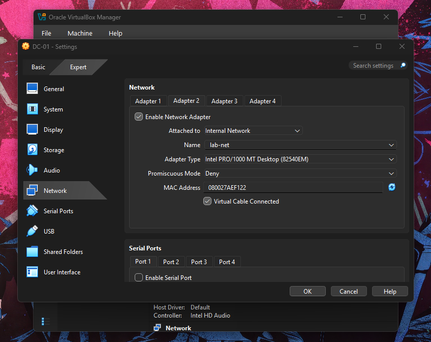
     
4. **Guest Additions:**
   - Mounted VBoxWindowsAdditions.iso and executed `VBoxWindowsAdditions-amd64.exe` on both machines to enable full driver support.

## Phase 1: OS Deployment
- **DC-01:** Installed Windows Server 2022 Standard (Desktop Experience). Set Administrator password to `P@ssword123`.
- **USER-01:** Installed Windows 10 Pro. 
  - Offline setup: Skipped internet connection (Limited Setup).
  - User: `j-lanes` 
  - Privacy: Disabled telemetry, diagnostic data, and Cortana.

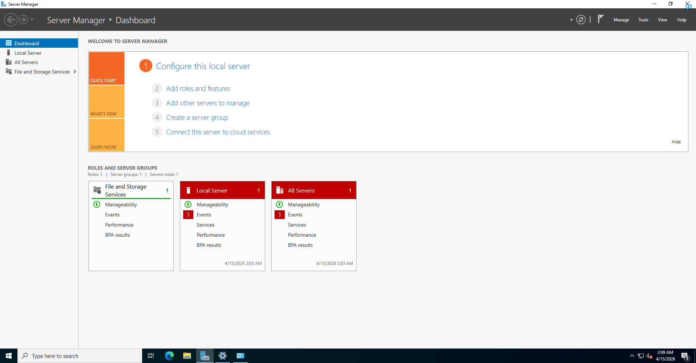 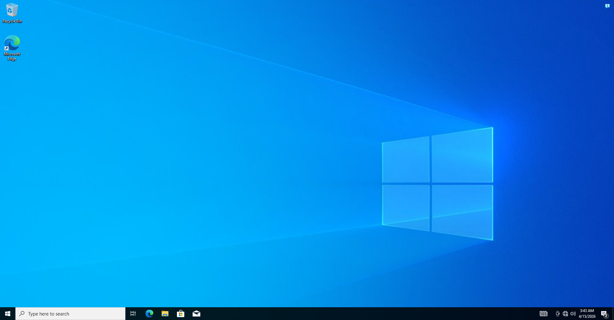

## Phase 2: Network Setup
### 1. Host Renaming
- Renamed Server to `DC-01`.
- Renamed Client to `USER-01`.
- Performed system restarts to apply changes.

### 2. Static IP Assignment (DC-01) & (USER-01)
- Navigated to `ncpa.cpl` to configure IPv4 properties.
- **DC-01:** IP `192.168.10.10` | DNS `127.0.0.1`
- **USER-01:** IP `192.168.10.20` | DNS `192.168.10.10`

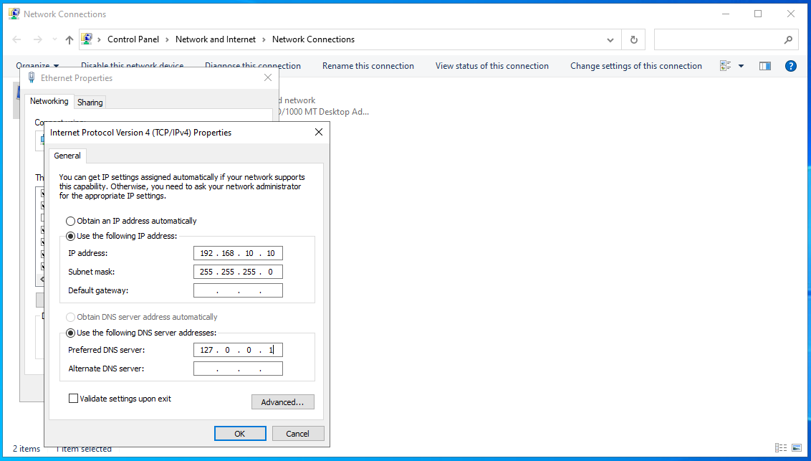 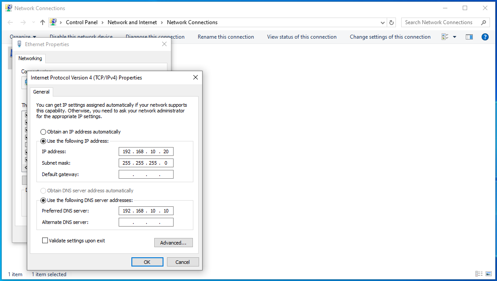

### 3. IP Verification
- Verified active configurations via `ipconfig`.

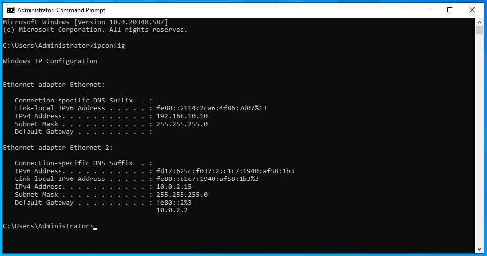 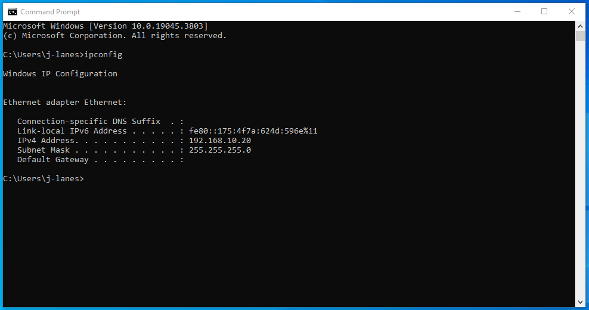

### 4. Firewall & Verification
- **DC-01:** Modified Windows Defender Firewall Inbound Rules.
  - Enabled: `File and Printer Sharing (Echo Request - ICMPv4-In)`.

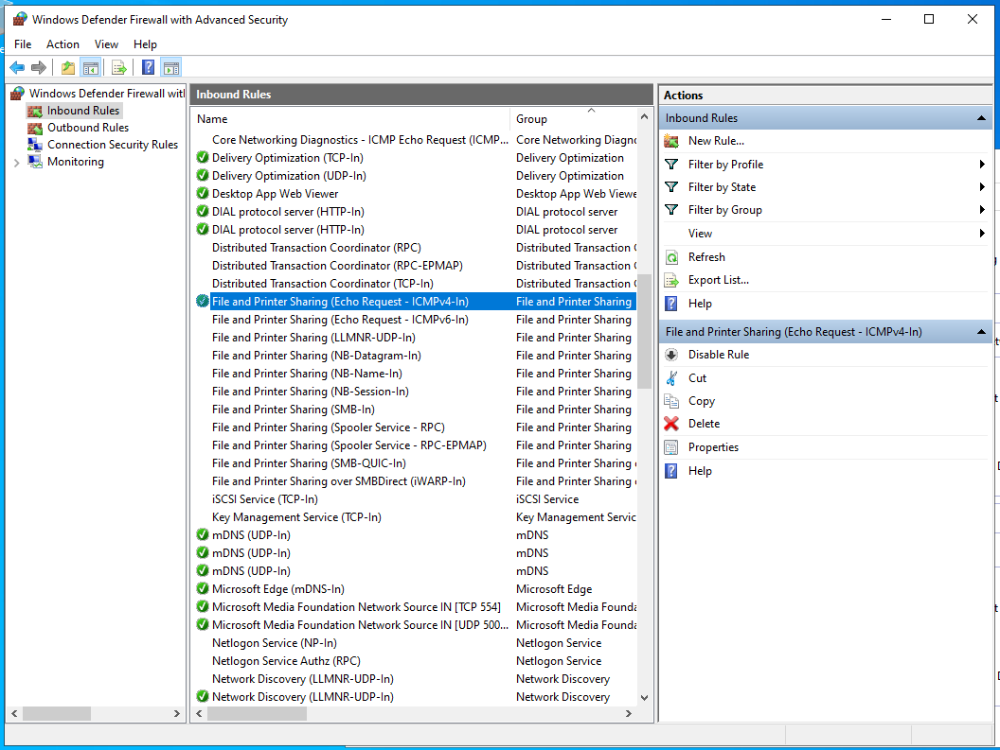 
    
- **Validation:** Successfully verified connectivity by pinging `192.168.10.10` from the `USER-01` Command Prompt.

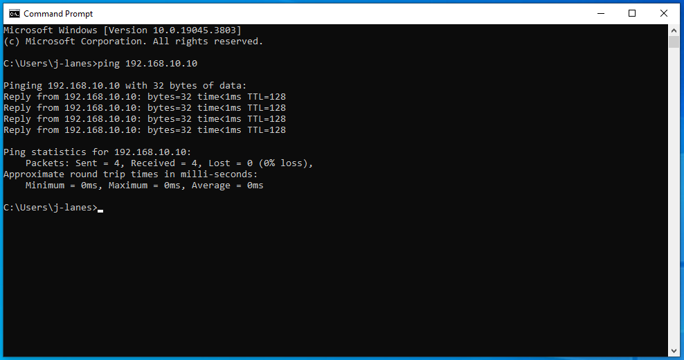

## Phase 3: Install Active Directory 

### 1. Role Installation
- Navigate to **Server Manager** -> **Manage** -> **Add Roles and Features**.
- Selected **Active Directory Domain Services** and **DNS Server** roles.
- Confirmed the addition of required management features and initiated the installation process.

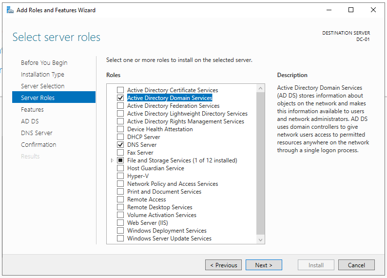

### 2. Domain Controller Promotion
- Accessed the **Deployment Configuration** through the yellow Server Manager notification flag.
- Selected **Add a new forest** and set the root domain name as `jlab.local`.
- Configured Domain Controller Options and Functional Level of **Windows Server 2016** and set the DSRM password.

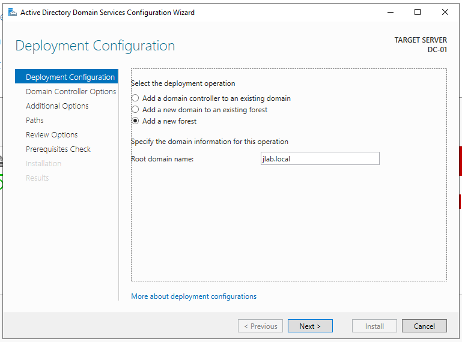

### 3. Prerequisites and Deployment
- Ran the **Prerequisites Check** to ensure environment compatibility.
- Confirmed "All prerequisite checks passed successfully" status.

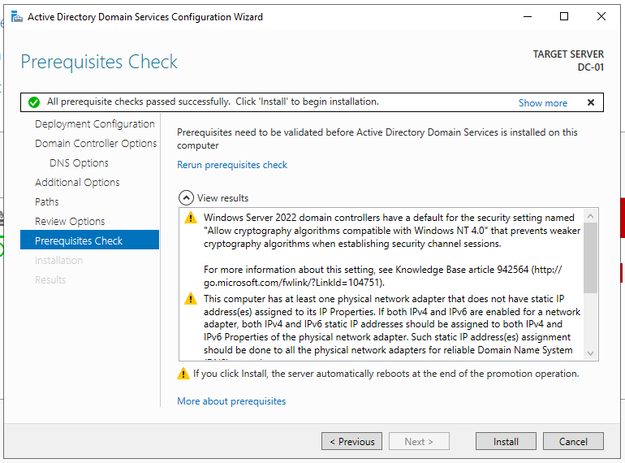

### 4. After Promotion Status
- Confirmed that the server is successfully operating as a Domain Controller by validating the **AD DS** and **DNS** service status.
- Authenticated via the new domain administrator context: `JLAB\Administrator`.

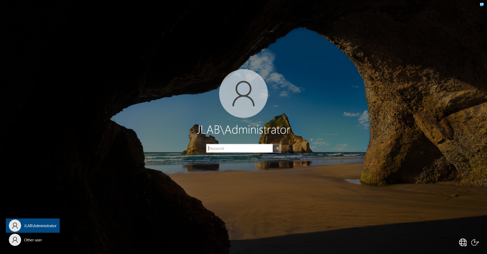 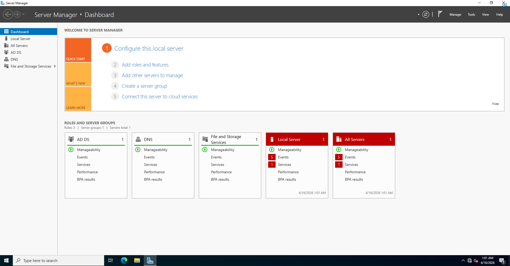

## Phase 4: Domain Setup (OUs & Users)

### 1. DNS and Network Optimization
- After promotion, I updated DC-01 IPv4 configuration to point to it's own static IP (`192.168.10.10`) for DNS resolution.

### 2. Organizational Unit (OU) Structure
- Established a new OU structure within **Active Directory Users and Computers**.
- Created three primary OUs:
    - **_Users**: For administrative and standard user identities.
    - **_Workstations**: For managing clients like USER-01.
    - **_Servers**: For future member server expansion.

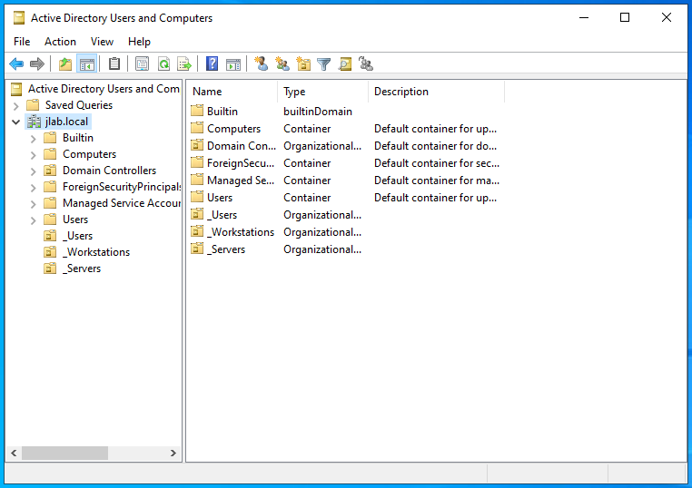

### 3. Users & Admins
- I set up two different accounts:
- **Standard User (`u-jones / User Jones`)**
- **Admin User (`a-mason / Admin Mason`)**, added this account to the **Domain Admins** group.

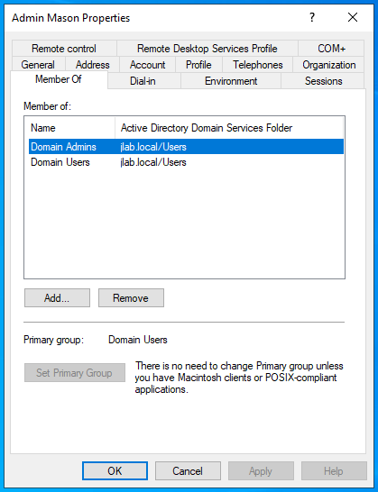

## Phase 5: Client Join (USER-01)

### 1. Domain Membership Change
- Changed the membership from a Workgroup to the **`jlab.local`** domain. I authenticated the join using the domain administrator credentials created in Phase 4.

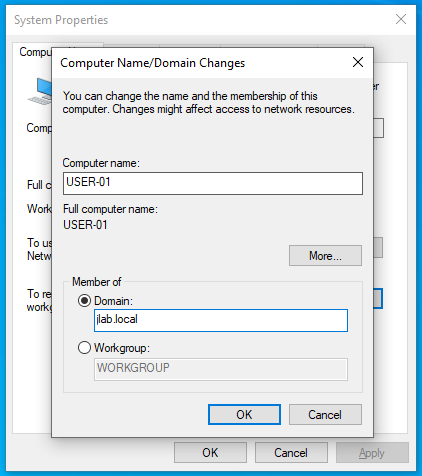

## Phase 6: Verification

### 1. Domain Authentication
- After reboot, I logged into **USER-01** using the standard domain account (`JLAB\user1`).
- Verified the identity with the `whoami` and `hostname` command.

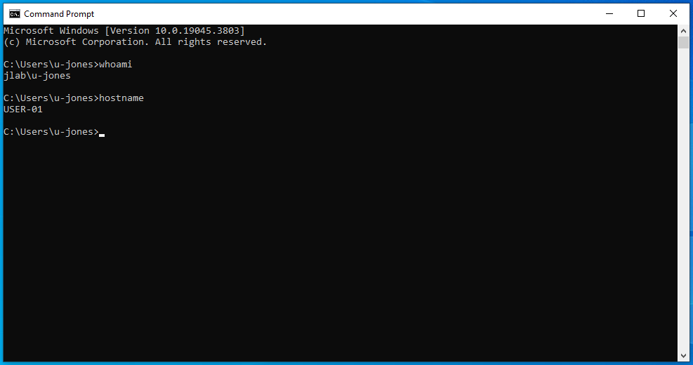

### 2. Active Directory Object Management
- On **DC-01**, I verified that **USER-01** appeared in the directory.
- Moved the computer object from the default container into the **`_Workstations`** OU.

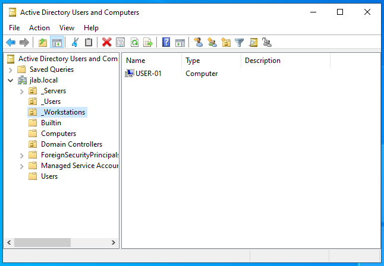

---
**Lab 01 Finished.**

  
