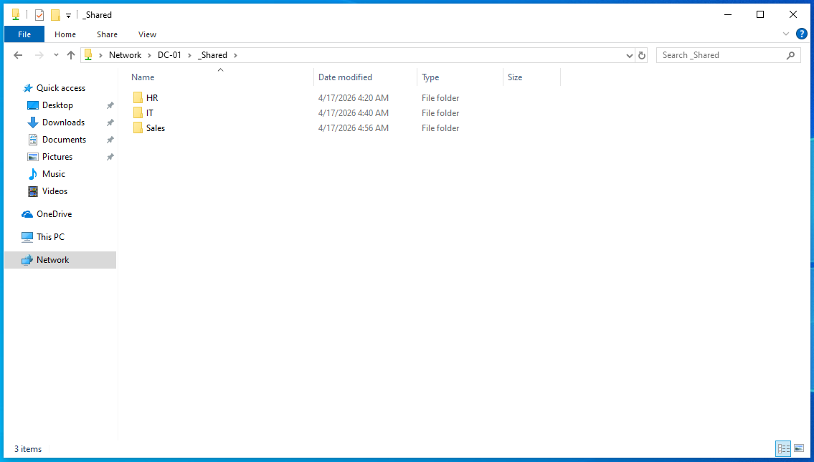

# Lab 02 – Users, Groups, and Permissions

## Objective
To transform the basic domain into a simulated corporate environment by implementing a departmental hierarchy, provisioning users, and enforcing the Principle of Least Privilege through NTFS permissions.

## Lab Setup / Environment
- **DC-01: Domain Controller (jlab.local)**
- **USER-01: Windows 10 Workstation**
- **Goal:** Enforce the Principle of Least Privilege (PoLP) across HR, IT, and Sales.

---

## Phase 1: Organizational Structure (OUs)
Established a departmental OU hierarchy under a primary `_Company` container within **Active Directory Users and Computers (ADUC)**.
- Created the **`_Company`** root OU.
- Created sub-OUs for **`IT`**, **`HR`**, and **`Sales`** to logically separate departmental objects.

## Phase 2: User & Group Provisioning
Implemented a "Groups-First" security model, ensuring that permissions are managed at the group level for scalability.
1. **Security Groups:** Created `IT_Admins`, `HR_Staff`, and `Sales_Team` within their respective OUs.
2. **User Creation:** Provisioned two users per department with a standard password policy.
3. **Group Membership:** Assigned users to their specific departmental groups.

## Phase 3: File Server & Network Sharing
Configured **DC-01** to act as a centralized file server.
- **Services:** Enabled **Function Discovery Publication** and turned on **Network Discovery** to ensure the server was visible to clients.
- **Root Share:** Created `C:\_Shared` and shared it as `_Shared`.
- **Share Permissions:** Set **`Everyone: Full Control`** at the sharing level to allow the NTFS layer to handle granular security restrictions.

## Phase 4: NTFS Permissions (The Lockdown)
Applied the Principle of Least Privilege by hardening subfolders and managing inheritance.
1. **Disabling Inheritance:** On each subfolder (`HR`, `IT`, `Sales`), inheritance was disabled and existing permissions were converted to explicit entries.
2. **Departmental Access:** - Removed the default `Users (JLAB\Users)` group to block general domain access.
   - Added specific departmental groups (e.g., `HR_Staff`) with **Modify** permissions.
3. **The "Hallway" Permission:** Resolved a common access issue where users were blocked from navigating the root share. Added the `Users` group to the `_Shared` root folder with **"Read & Execute"** (This folder only) to allow navigation to departmental subfolders.

  

## Phase 5: Verification & Testing
Validated the security model from **USER-01** by logging in as a Sales user (`s-monroe`).

### 1. Root Access & Navigation
Verified that the "Hallway" fix allowed the user to see the departmental folders at the root share without accessing forbidden content.

 

### 2. Departmental Access (Success)
Confirmed the Sales user could successfully read and write within the **Sales** folder.

### 3. Cross-Departmental Security (Failure)
Confirmed that the same Sales user was strictly forbidden from entering the **HR** folder, proving that NTFS permissions correctly enforced departmental boundaries.

---
**Lab 02 Finished.**
