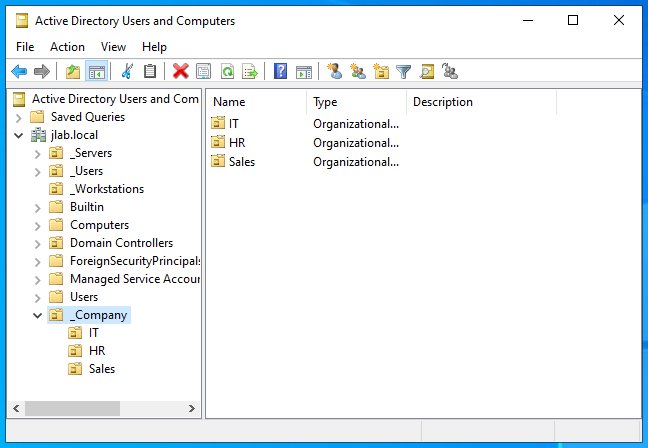
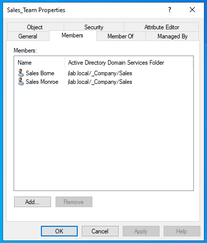
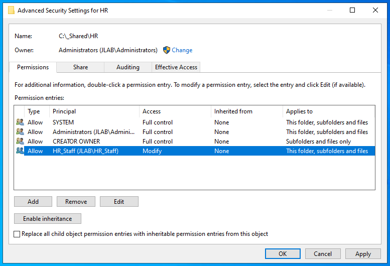
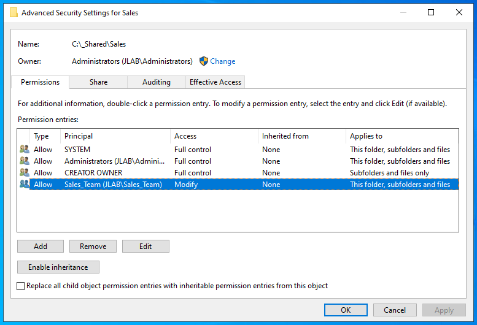
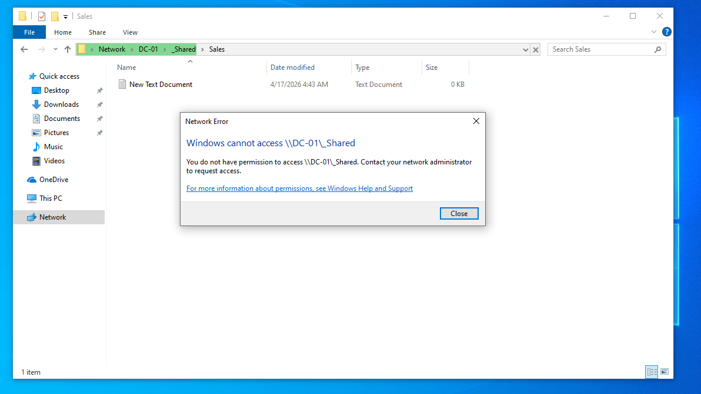
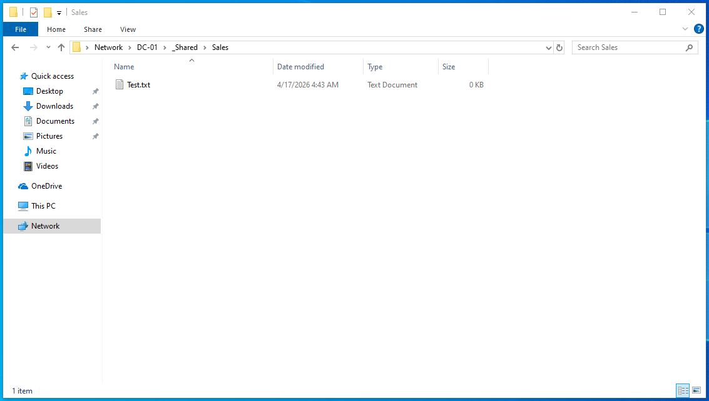
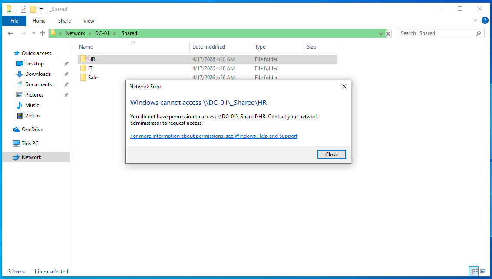

# Lab 02 – Users, Groups, and Permissions

## Objective
Transform the basic domain into a simulated corporate network by setting up departmental OUs, creating users/groups, and configuring NTFS permissions to enforce the Principle of Least Privilege.

## Lab Setup / Environment
- **DC-01 (Windows Server 2022)**
  - Domain Controller & File Server
  - `192.168.10.10`
- **USER-01 (Windows 10 Pro)**
  - Domain Client
  - `192.168.10.20`
  
---

## Phase 1: Organizational Unit (OU) Structure
- Opened **Active Directory Users and Computers** and created a top-level OU called **`_Company`**.
- Created three sub-OUs: **`IT`**, **`HR`**, and **`Sales`** to keep the department objects organized.

## Phase 2: Users & Groups
- Created departmental Security Groups: `IT_Admins`, `HR_Staff`, and `Sales_Team`.
- Added two users per OU (e.g., `s-monroe / Sales Monroe`). 
- Set all passwords to `P@ssword123`.
- Added the users to their respective groups so permissions can be managed at the group level.

## Phase 3: File Share Setup
- On **DC-01**, created a root folder `C:\_Shared | \\DC-01\_Shared` with subfolders for `HR`, `IT`, and `Sales`.
- Enabled **Network Discovery** and started the **Function Discovery Publication** service to make the server visible.
- **Sharing:** Set `\\DC-01\_Shared` to Advanced Sharing. Permissions: `Everyone: Full Control` (so NTFS handles the actual security).

## Phase 4: NTFS Permissions
- For each subfolder (`HR`, `IT`, `Sales`), I disabled inheritance and converted permissions to explicit.
- **Lockdown:** Removed the `Users` group to block general access.
- **Access:** Added the specific departmental group with **Modify** permissions.

  

---

## Phase 5: Troubleshooting Access
- **The Issue:** Logged into **USER-01** as `s-monroe` and tried to open `\\DC-01\_Shared`. I got an "Access Denied" error immediately.
- **The Reason:** While the user had rights to the Sales *subfolder*, they didn't have permission to even see the root `\\DC-01\_Shared` folder.

- **The Fix:** On **DC-01**, I added the `Users` group to the `\\DC-01\_Shared` root folder with **Read & Execute** permissions, but set it to **"This folder only"** so they couldn't see into other departments.

---

## Phase 6: Verification

### 1. Navigation & Write Test
- Logged into **USER-01** as the Sales user (`s-borne`).
- Successfully browsed to `\\DC-01\_Shared` and entered the **Sales** folder.
- Created `Test.txt` to prove write access works.

 

### 2. Security Test (Negative Test)
- Attempted to open the **HR** folder as the Sales user (`s-borne`).
- Successfully blocked with an "Access is Denied" popup.

---
**Lab 02 Finished.**
