# Lab 03 – Group Policy

## Objective
Learn centralized control of users and machines using Group Policy in a Windows Server Active Directory environment.

## Lab Setup / Environment
- **DC-01 (Windows Server 2022)**
  - Domain Controller & GPO Management
  - IP: `192.168.10.10`
- **USER-01 (Windows 10 Pro)**
  - Domain Client (Testing environment)
  - Logged in as: `JLAB\s-borne` (Sales Dept)

---

## Phase 1: Open GPMC (Setup)
- On **DC-01**, opened the **Group Policy Management Console** (`gpmc.msc`).
- Expanded the forest and domain to reveal the OU structure created in Lab 02.
- **Note:** Group Policy Objects are created in the "Group Policy Objects" folder (the vault) before being linked to specific OUs.

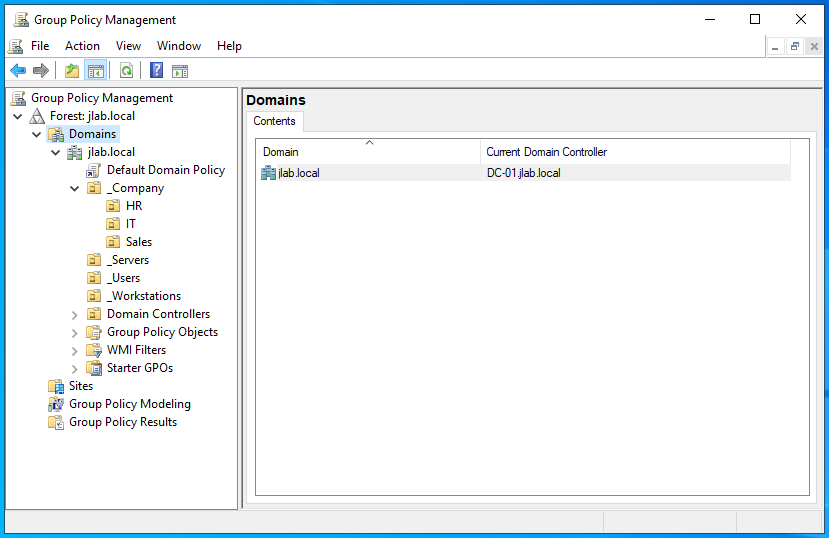

## Phase 2: Domain-Wide Password Policy
- **Requirement:** Password policies must be set at the Domain level to affect domain accounts.
- Edited the **Default Domain Policy**.
- **Path:** `Computer Configuration > Policies > Windows Settings > Security Settings > Account Policies > Password Policy`
- **Settings:** - Minimum password length: **10 characters**
  - Password must meet complexity requirements: **Enabled**

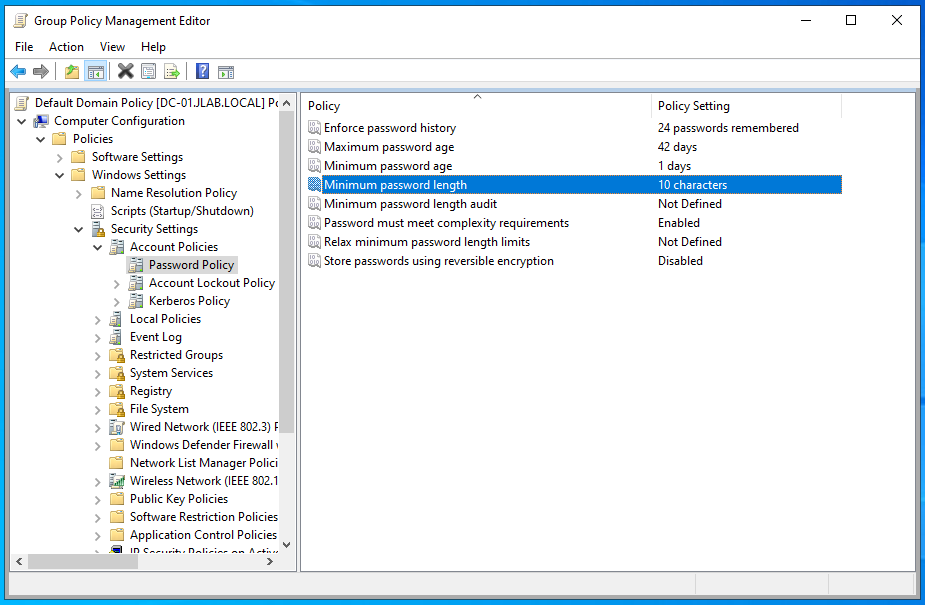

## Phase 3: Interactive Login Banner
- Created a new GPO: `SEC_Login_Banner`.
- **Path:** `Computer Configuration > Policies > Windows Settings > Security Settings > Local Policies > Security Options`
- **Settings:**
  - **Interactive logon: Message title:** `JLAB Security Notice`
  - **Interactive logon: Message text:** `Authorized access only. Activity is monitored.`
- **Linking:** Linked the GPO to the root of the `jlab.local` domain.

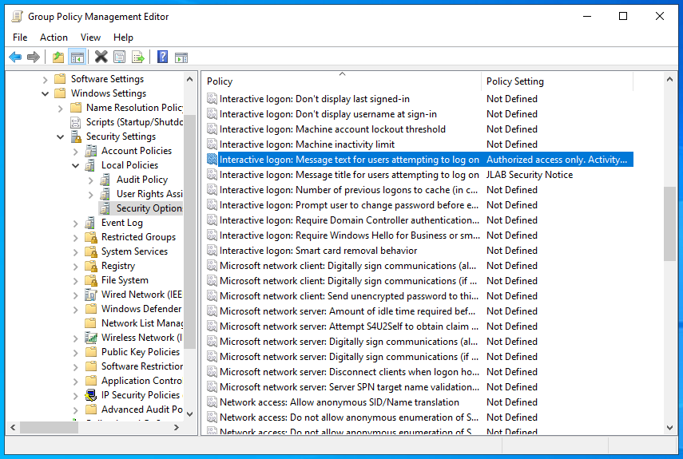

## Phase 4: Endpoint Hardening (Control Panel)
- Created GPO: `USER_Restrict_ControlPanel`.
- **Path:** `User Configuration > Policies > Administrative Templates > Control Panel`.
- **Action:** Enabled **"Prohibit access to Control Panel and PC settings"**.
- **Linking:** Linked to the **`_Company`** OU to restrict all staff users.

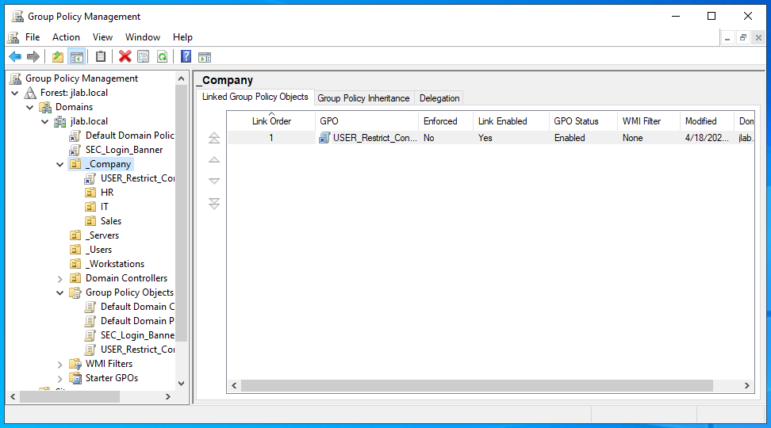

## Phase 5: Network Drive Mapping
- Created GPO: `USER_Drive_Maps`.
- **Path:** `User Configuration > Preferences > Windows Settings > Drive Maps`.
- **Configuration:** - **Action:** Create | **Location:** `\\DC-01\Sales` | **Drive Letter:** `S:` | **Label:** `Sales Data`.
- **Linking:** Linked to the **`_Company`** OU.

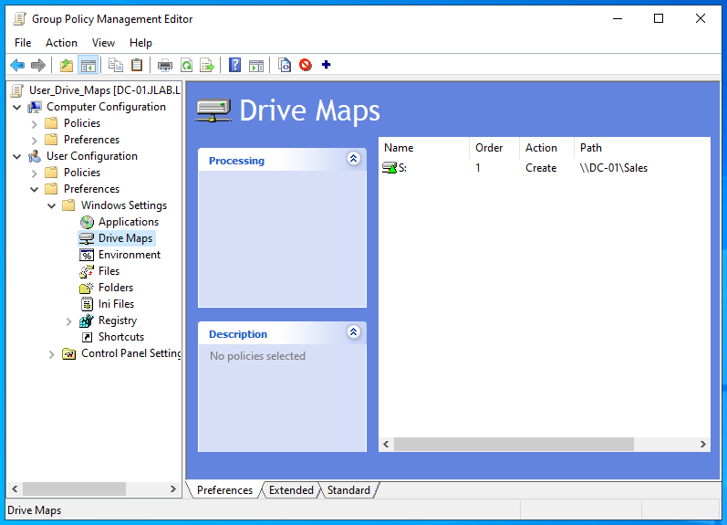

## Phase 6: Screen Lock Timeout
- Created `SEC_Screen_Lock`. 
- **Settings:** Configured Screen Saver to be **Enabled**, **Password Protected**, and set a timeout of **600 seconds**.
- Linked to the **`_Company`** OU.

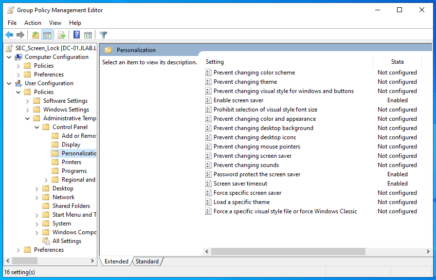

---

## Phase 7: Wallpaper
- Created a `Public` folder on `C:\` and shared it as `\\DC-01\Public` with **Read** permissions for **Everyone**.
- Created `USER_Wallpaper` GPO.
- **Path:** `User Configuration > Policies > Admin Templates > Desktop > Desktop > Desktop Wallpaper`.

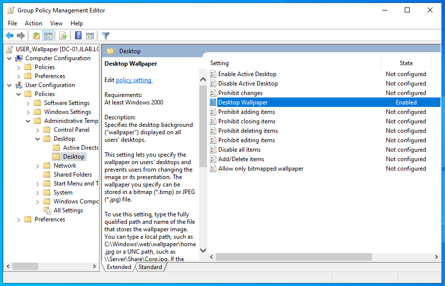

---

## Phase 8: Verification & Troubleshooting

### 1. Policy Audit
- Ran `gpresult /r` on **USER-01** to confirm all GPOs were successfully received from the DC.

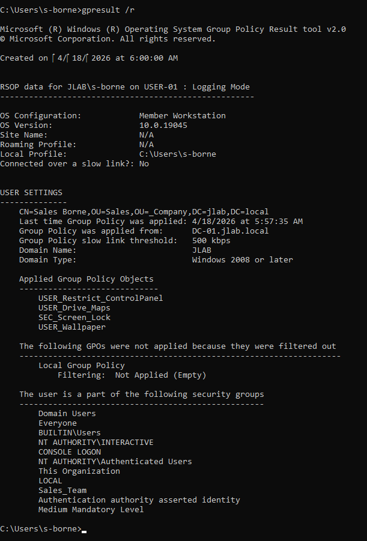

### 2. Wallpaper Extension Fix
- **Issue:** Wallpaper failed to appear initially on **USER-01**.

- **Discovery:** Verified the GPO path was pointing to `.jpg` while the actual source file in the Public share was a `.png`.
- **Fix:** Corrected the file extension in the GPO setting to `\\DC-01\Public\USER_Wallpaper.png`.

### 3. Drive Map (S: Drive) Fix
- **Issue:** The S: drive did not appear under "This PC" even after a `gpupdate /force`.

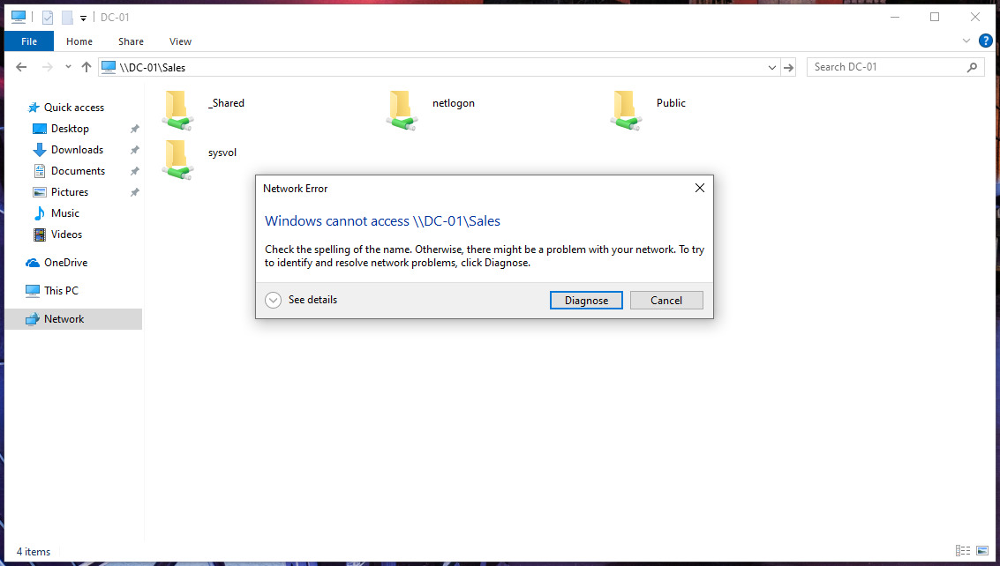
  
- **Discovery:** Attempting to browse `\\DC-01\Sales` manually resulted in a network error. While the folder existed at `C:\_Shared\Sales`, it was not explicitly shared as a top-level share.
- **Fix:** On **DC-01**, configured the Sales folder with **Advanced Sharing** using the share name **`Sales`**.

### 4. Functional Confirmation

- **Screen Lock Timeout:** Confirmed the screen lock timeout by waiting 600 seconds.
- **Login Banner:** Confirmed login banner is working and shows up for user.
- **Wallpaper:** Wallpaper successfully applied via UNC path.
- **Control Panel:** Verified "Access Denied" when attempting to open system settings.
- **S: Drive:** The Sales Data network drive is now mapped and accessible in File Explorer.

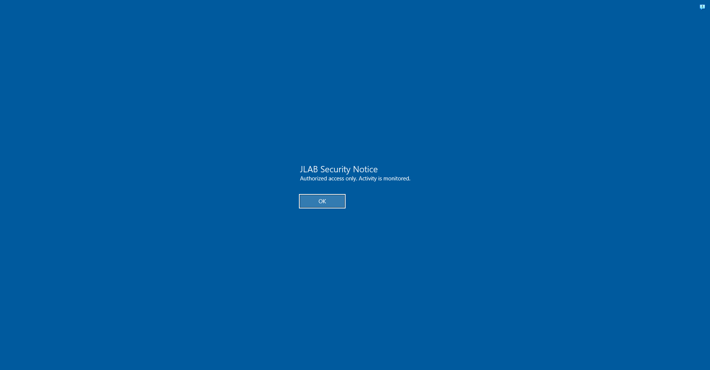
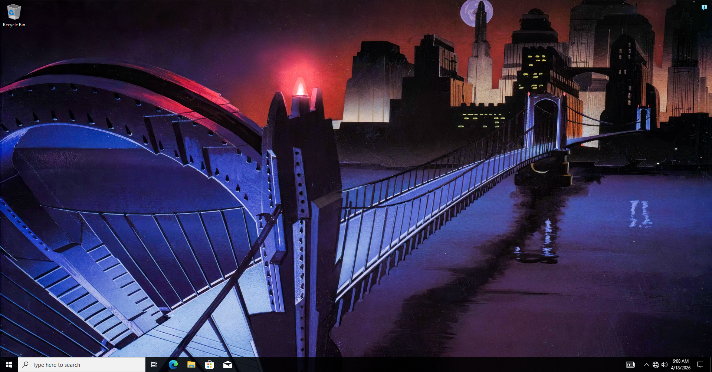
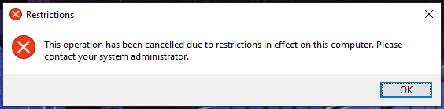
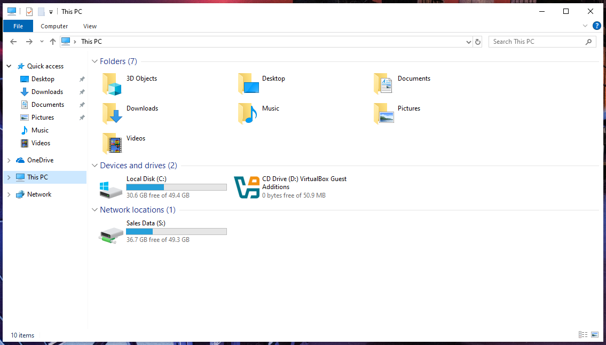

---
**Lab 03 Finished.**
